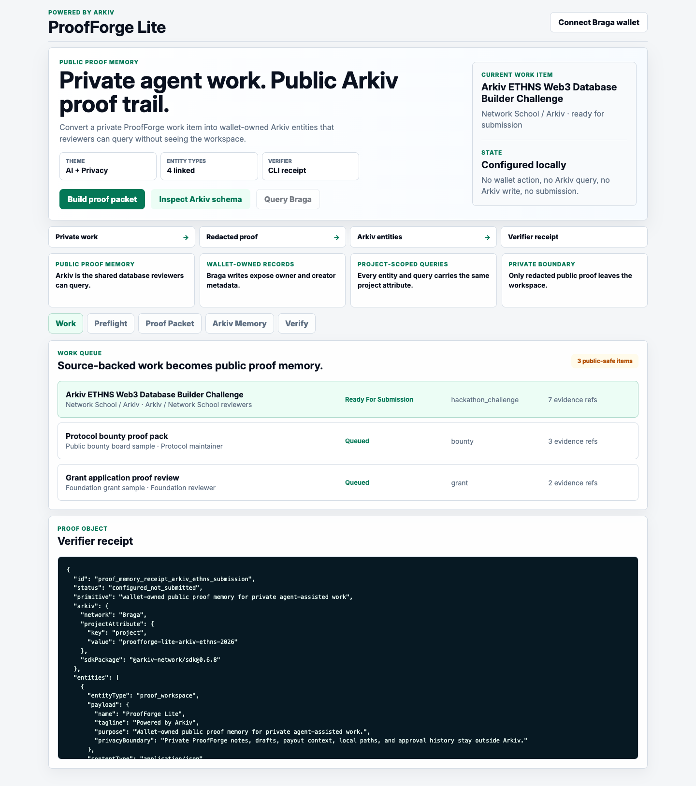
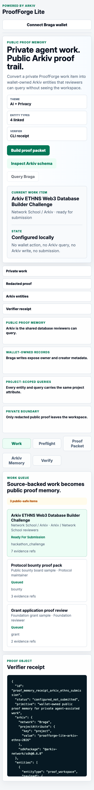

# ProofForge Lite: Powered by Arkiv

ProofForge Lite is a web3-native proof workspace for agent-assisted work. It
uses Arkiv as the public proof memory database: work items, redacted proof
packets, and review events are written as wallet-owned Arkiv entities that
reviewers can query without seeing the private workspace behind the proof. In
the live flow, all durable public ProofForge Lite records are represented as
Arkiv entities; the bundled JSON files are only public-safe demo configuration
and example verifier input for local review.

## Challenge Theme

Hybrid: AI + Privacy.

- AI: a bounded proof node turns private agent-assisted work into a public-safe
  proof packet.
- Privacy: only redacted summaries, typed attributes, hashes, and review state
  are published; private notes, drafts, local logs, payout setup, and signing
  secrets stay outside Arkiv.

## Team

- Devinson Pena: builder and maintainer.

## Challenge Status

Built for the Arkiv ETHNS Web3 Database Builder Challenge.

Official deadline: May 25, 2026 23:59 UTC.

This README separates live, configured, and roadmap claims. Final public
submission must replace pending live references with the deployed demo URL,
real Arkiv entity keys, transaction hashes, owner, creator, and verifier output.

## What It Demonstrates

This is not a generic Arkiv CRUD demo. It demonstrates a reusable primitive:

```text
private ProofForge work
-> redacted proof packet
-> linked Arkiv entities
-> project-scoped queries
-> verifiable receipt
```

The first proof object is this Arkiv challenge submission itself. The app also
includes public-safe sample work items to show that the same flow can support
future bounties, grants, and open-source proof packets without exposing private
opportunity intelligence.

## Demo Flow

```text
Work
-> Preflight
-> Proof Packet
-> Arkiv Memory
-> Verify
```

In the live demo, the browser writes four linked entity types to Arkiv Braga and
then queries them back through project-scoped filters.

## Screenshots

Desktop:



Mobile:



## Arkiv Integration

Arkiv is the primary data layer for public proof memory. After the approved
live write, every durable public app record in this Lite workspace exists as a
project-scoped Arkiv entity rather than a private database row.

For the challenge requirement that app data lives on Arkiv, ProofForge Lite
treats the deployed Braga write as the source of truth. The repository's JSON
files are seed configuration, example evidence shapes, and verifier fixtures;
they are not the submitted public database. The submitted demo must show the
Work queue, selected proof packet, and review event written to Arkiv and then
queried back by project-scoped filters.

The project defines a unique namespace:

```ts
export const PROJECT_ATTRIBUTE = {
  key: "project",
  value: "proofforge-lite-arkiv-ethns-2026",
} as const;
```

Every entity and every query includes this project attribute.

Entity types:

- `proof_workspace`: wallet-owned namespace for this proof memory;
- `work_item`: each public-safe task/challenge/opportunity in the Work queue;
- `proof_packet_summary`: redacted proof result for the selected work item;
- `review_event`: linked decision/submission-readiness event.

Relationships:

- `work_item.proofWorkspaceKey -> proof_workspace.$key`;
- `proof_packet_summary.proofWorkspaceKey -> proof_workspace.$key`;
- `proof_packet_summary.workItemKey -> work_item.$key`;
- `review_event.workItemKey -> work_item.$key`;
- `review_event.packetId -> proof_packet_summary.packetId`.

Queries:

- work items by project;
- work items by project and status;
- proof packets by project and status;
- proof packets by project and source type;
- proof packets by project and created time range;
- review events by project and proof workspace key;
- review events by project and work item key.

The live write persists the full public-safe Work queue as `work_item`
entities, then links the selected proof packet and review event to the selected
work item. The live receipt verifies entity keys for every Work row,
transaction hashes, `$owner`, `$creator`, metadata provenance from the linked
`review_event`, relationship links, and query evidence counts.

## Tech Stack

- Frontend: lightweight TypeScript web app bundled with `esbuild`.
- Data layer: Arkiv Braga testnet.
- SDK: `@arkiv-network/sdk`.
- Wallet: browser EVM wallet with an explicit Braga chain guard before writes.
- Proof object: JSON receipt.
- Verifier: deterministic Node script.

## Setup Notes

### Local Verification

Run the local proof check:

```bash
npm ci
npm run check
```

The repository also includes `.github/workflows/check.yml`, which runs the same
`npm ci` and `npm run check` path on push and pull request.

For a faster UI/deploy smoke check after building:

```bash
npm run build:web
npm run smoke:web
npm run test:demo-path
```

`npm run test:demo-path` starts the bundled app locally, clicks through the
Work, Preflight, Proof Packet, Arkiv Memory, and Verify path on desktop and
mobile viewports, and confirms the wallet/live-query/live-write controls stay
gated before approval.

The verifier checks:

- required entity types exist;
- every entity includes the project attribute;
- every required query includes the project attribute;
- numeric attributes are numeric;
- required relationships exist;
- public proof payloads do not include private workspace material;
- configured receipts do not claim a transaction before wallet write;
- live receipts include entity keys, all three write transaction hashes, owner, creator,
  linked review-event metadata provenance, relationship links, and query evidence
  counts;
- the Arkiv adapter imports and bundles against the pinned SDK version.

Run the verifier failure checks directly:

```bash
npm run test:verifier
```

This proves the verifier rejects missing project scope, broken live
relationships, incomplete live write transaction evidence, and private workspace
leakage.

Run the local UI:

```bash
npm run build:web
npm run dev
```

Then open:

```text
http://127.0.0.1:4173/
```

## Privacy Boundary

Arkiv entities are publicly readable. This project treats Arkiv as the public
proof memory layer, not as the private operating workspace.

Published:

- public-safe work item summaries;
- redacted proof summaries;
- source type;
- status;
- artifact hashes;
- risk/evidence counts;
- review event summaries;
- Arkiv relationship keys after live write.

Not published:

- private opportunity notes;
- execution transcripts;
- payment setup metadata;
- drafts;
- signing secrets;
- machine-specific filesystem paths.

## Live / Configured / Roadmap

Live in the local package:

- public-safe receipt generation;
- deterministic schema/redaction verification;
- bundled five-step ProofForge Lite app surface.

Configured for the final app:

- Arkiv Braga write/query adapter using `@arkiv-network/sdk`;
- wallet-gated entity creation with Braga chain switch/add handling;
- query views by project, status, source, relationship, and time range;
- durable public app data modeled as `proof_workspace`, `work_item`,
  `proof_packet_summary`, and `review_event` Arkiv entities after live write.

Roadmap:

- maintainer acceptance signatures;
- encrypted private payload grants;
- production ProofForge integration.

## Deployment

The app is a static browser bundle. After Approval 1 and live Arkiv evidence,
build the deployable assets:

```bash
npm run build:web
```

Vercel can use the included `vercel.json`:

```json
{
  "buildCommand": "npm run build:web",
  "outputDirectory": "web",
  "installCommand": "npm ci"
}
```

Deploy the `web/` directory to a static host. The deployed demo must use HTTPS,
load `web/index.html`, `web/styles.css`, and `web/app.bundle.js`, and connect to
Arkiv Braga from the browser with the approved wallet. No server secrets or
private ProofForge files are required for deployment.

Before final submission, replace this deployment section with the deployed demo
URL, live Arkiv entity keys, transaction hashes, owner, creator, and verifier
output.

Live submission setup:

1. Connect an EVM wallet to Braga testnet.
2. Let the app switch/add Braga in the wallet when prompted.
3. Use the faucet if needed.
4. Click `Write Arkiv entities` to create the proof workspace, every public-safe
   Work queue item, the proof packet summary, and the review event.
5. Click `Query Braga` after the write completes if the app has not already
   refreshed query evidence. Query by project, status, source, relationship,
   and time.
6. Click `Copy live result` and save the live write/query output in the
   `data/live-write-result.example.json` shape.
7. Validate the real live write/query result:

```bash
LIVE_WRITE_RESULT_PATH=data/live-write-result.json npm run live-result:check
```

8. Generate and verify the final receipt:

```bash
LIVE_WRITE_RESULT_PATH=data/live-write-result.json npm run finalize:receipt
RECEIPT_PATH=out/live-proof-memory-receipt.json npm run verify
```

See `docs/LIVE_EVIDENCE_GUIDE.md` for the full post-approval evidence path.
See `docs/WHY_ARKIV.md` and `docs/JUDGE_QUICKSTART.md` for the fastest review
path and rubric map.
Use `docs/DEMO_SCRIPT_3_MIN.md` and `docs/DEMO_RECORDING_CHECKLIST.md` for the
2 to 3 minute screen-share recording.
Use `docs/BRAGA_TEST_WALLET_SETUP.md` to prepare a public-safe burner wallet
without placing wallet recovery material or signing data in the repository.
